# OyamaCRM

**A professional nonprofit CRM platform — Donor management, Compassion CRM, Events, and AI-powered stewardship in one workspace.**


---

## License

OyamaCRM is distributed under a custom source-available license in [LICENSE.md](LICENSE.md).

- Qualified nonprofits under USD 1,000,000 in annual gross revenue may use it for free.
- Nonprofits at or above that threshold require a separate donation-based 3-year license approved by the Licensor.

---

## What is OyamaCRM?

OyamaCRM is an integrated nonprofit management platform built for teams that manage donors, clients, and events in one place.

| Module | Focus |
|--------|-------|
| **DonorCRM** | Donors, donations, campaigns, stewardship, grants, communications |
| **Compassion CRM** | Client intake, cases, appointments, care plans, assessments |
| **Events CRM** | Event ticketing, guests, seating, check-in, sponsors |

## Workspace and Workflow Standard (Current Rule)

All new product work follows a dedicated-workspace, one-direction workflow model.

- Dedicated workspace ownership: major tools should have a canonical route and workspace shell.
- One-direction flow: list/overview -> build/edit -> review/validate -> publish/activate -> history/activity.
- Functional-only UI: no fake data, dead controls, or placeholder behavior presented as complete.
- Legacy cleanup path: keep redirects/wrappers until replacement parity is proven, then remove duplicate flows.

Governance sources:

- `AGENTS.md`
- `docs/architecture/workspace-layout-system.md`
- `docs/status/production-readiness-checklist.md`

---

## What's New in v1.1.0

- **Help App expanded** — 60 published help articles covering all major modules (up from 28). Adds campaigns, constituent profiles, steward paths setup, contacts manager, pledges, retention analysis, email builder, events sponsors/tickets, compassion assessments/referrals, and 11 global/admin guides.
- **Help search engine improved** — 60+ nonprofit-domain synonym expansions (donor↔constituent, email↔campaign, grant↔funding, etc.), feature readiness boost in ranking, and 35+ route-to-context mappings.
- **Quick searches expanded** — 10 one-click help quick searches and 5 Help Agent starter prompts.
- **FEATURES.md** — New root-level complete feature inventory with status labels for all 120+ platform features.
- **Documentation updates** — `docs/HELP_APP.md` fully rewritten; `docs/status/features.md` and production-readiness checklist updated.
- **Version** — `package.json` version is now `1.1.0`.

---

## Screenshots (v1.1.0)

Screenshots were captured 2026-05-18 using the medium demo seed (`pnpm db:seed:medium`) with credentials `admin@hopefoundation.org` / `admin123!`.

### DonorCRM Dashboard
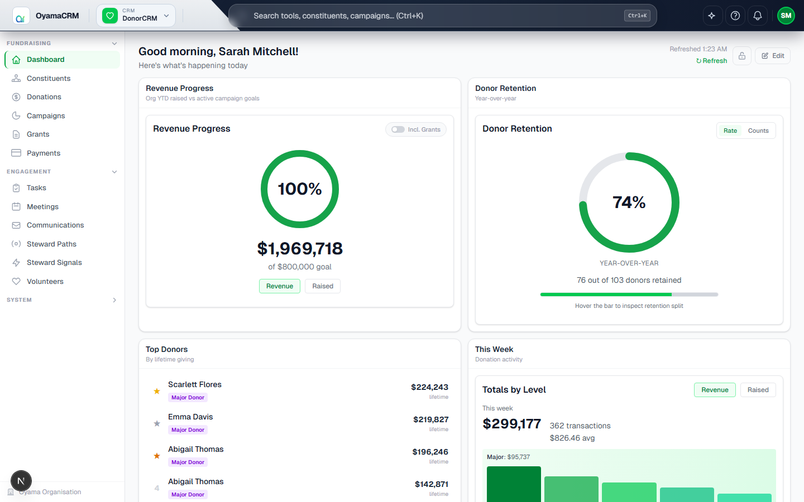
> Real-time fundraising overview with Revenue Progress widget, Campaign Goal Health, Donor Retention, Engagement Pulse, and customizable widget layout. Data from Hope Community Foundation demo org: 1,200+ constituents, 18,000+ donations.

### Constituents List
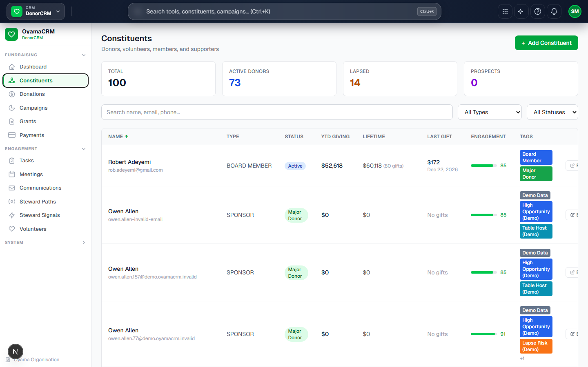
> Full constituent list with search, filters, and quick-action links. Supports household groups, donor levels, and engagement status filtering.

### Constituent Profile
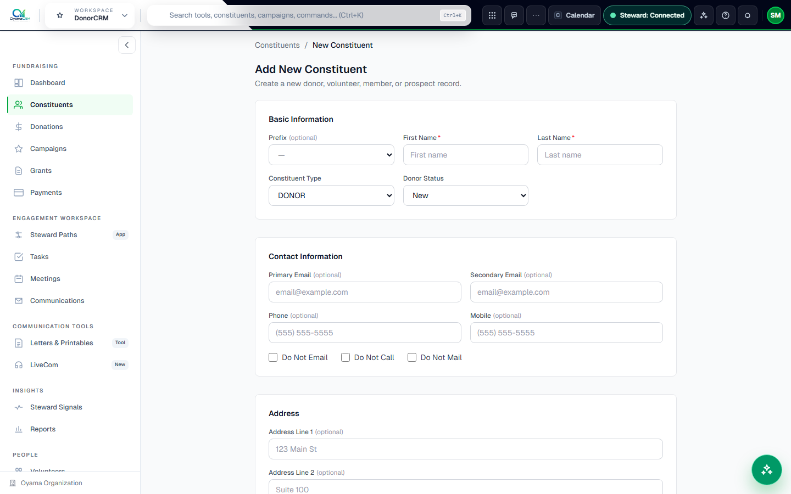
> Unified constituent profile with giving history, activity timeline, task tracking, communication log, and custom fields.

### Donations Ledger
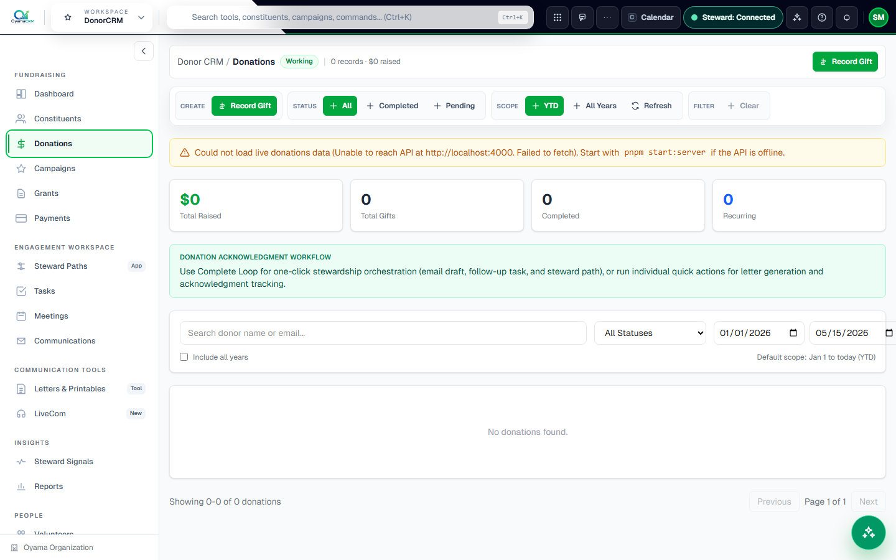
> Complete donation record with YTD/all-years scope toggle, one-click stewardship loop, and QuickBooks queue integration.

### Campaigns Workspace
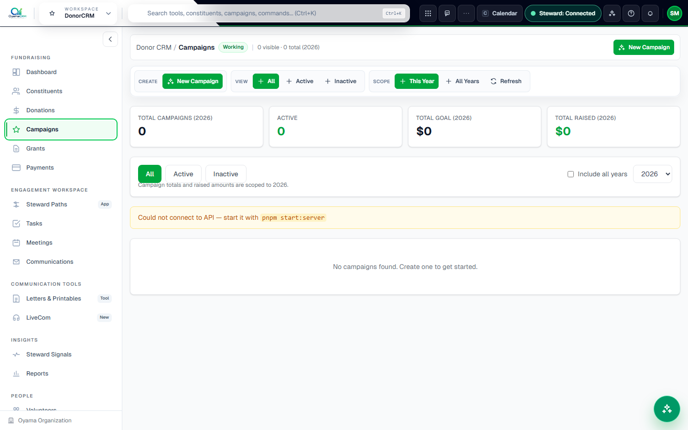
> Campaign goal tracking with revenue attainment, active/inactive views, and multi-year scope support.

### Grants Research Workspace
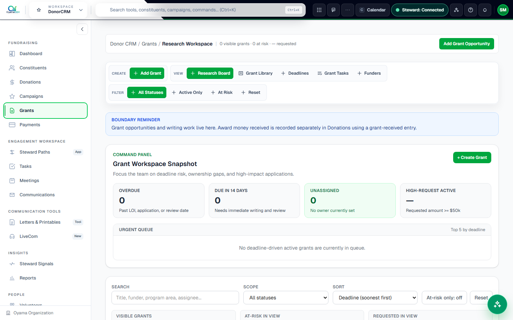
> Grant opportunity tracking with Research Board, Grant Library, Deadlines, Grant Tasks, and Funders views. Deadline-driven urgent queue and at-risk pipeline overview.

### Communications Campaign Workspace
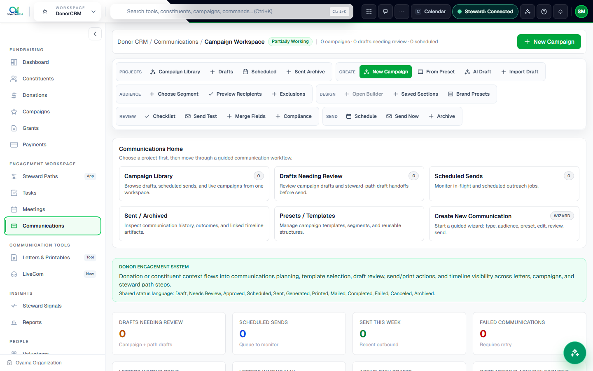
> Full campaign workspace with PROJECTS, AUDIENCE, DESIGN, REVIEW, and SEND ribbon groups. Guided wizard flow for new campaign creation.

### Steward Paths — Engagement Sequences
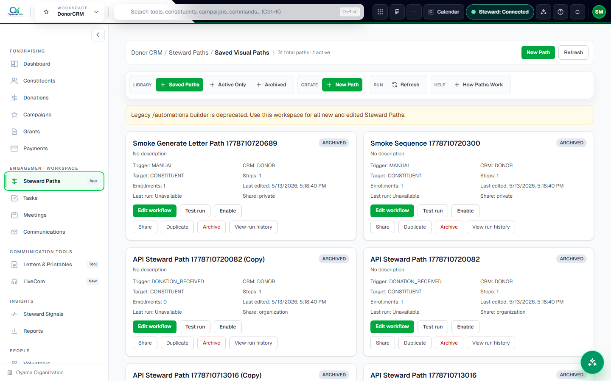
> Visual workflow automation library with saved paths. Supports task, email, letter, status-change, and branch-condition step types.

### Help Search App (v1.1.0 highlight)

> Built-in help workspace with 60 published articles, synonym-expanded search, feature readiness indicators, and contextual route suggestions.

### Contacts Manager — Audience List Builder

> Side-by-side constituent list builder for creating reusable audience segments. Supports bulk tagging, duplicate detection, and HubSpot import presets.

### Reports — Template Library
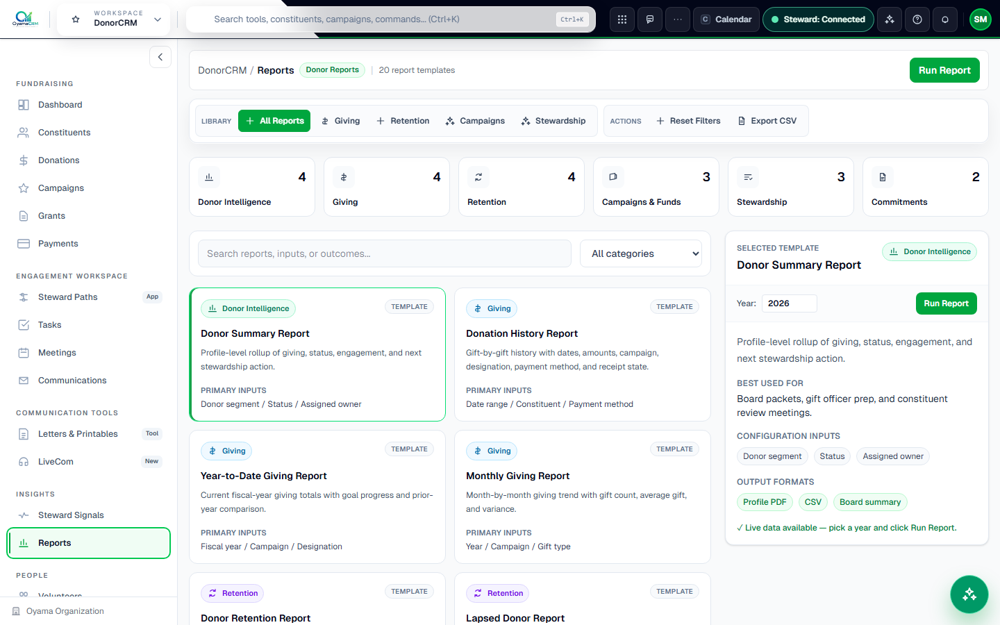
> 20 curated report templates across Donor Intelligence, Giving, Retention, Campaigns & Funds, Stewardship, and Commitments categories.

### Settings — Organization

> Organization settings including name, address, timezone, fiscal year start, and outbound email provider configuration.

### Steward Signals — AI-Powered Donor Intelligence
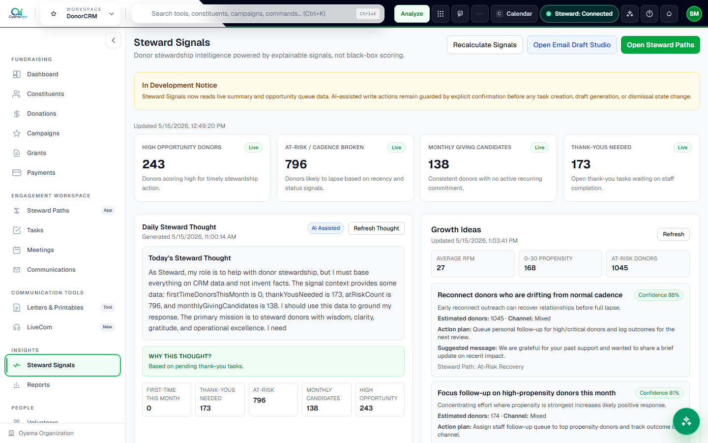
> Live donor intelligence: high-opportunity donors, at-risk cadences, monthly giving candidates. Daily Steward Thought with AI-generated Growth Ideas.

### Compassion CRM

> Compassion CRM dashboard with client services overview.

### Compassion Clients
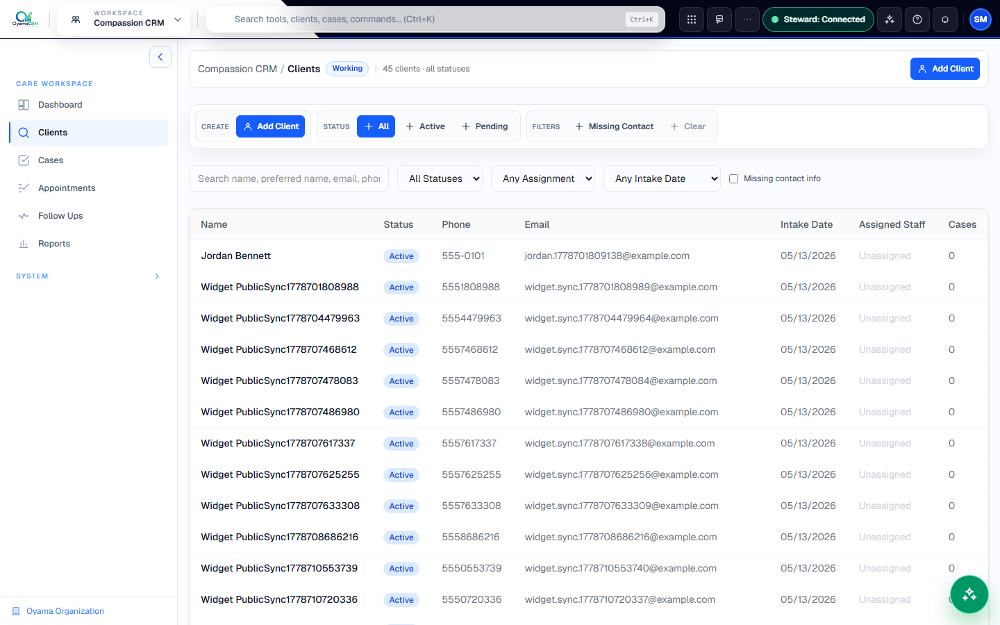
> Privacy-first client list with search, status filters, and scoped profile access.

### Compassion Appointments

> Appointment calendar with public booking widget support and conflict-free slot generation.

### Events CRM — Workspace Selector
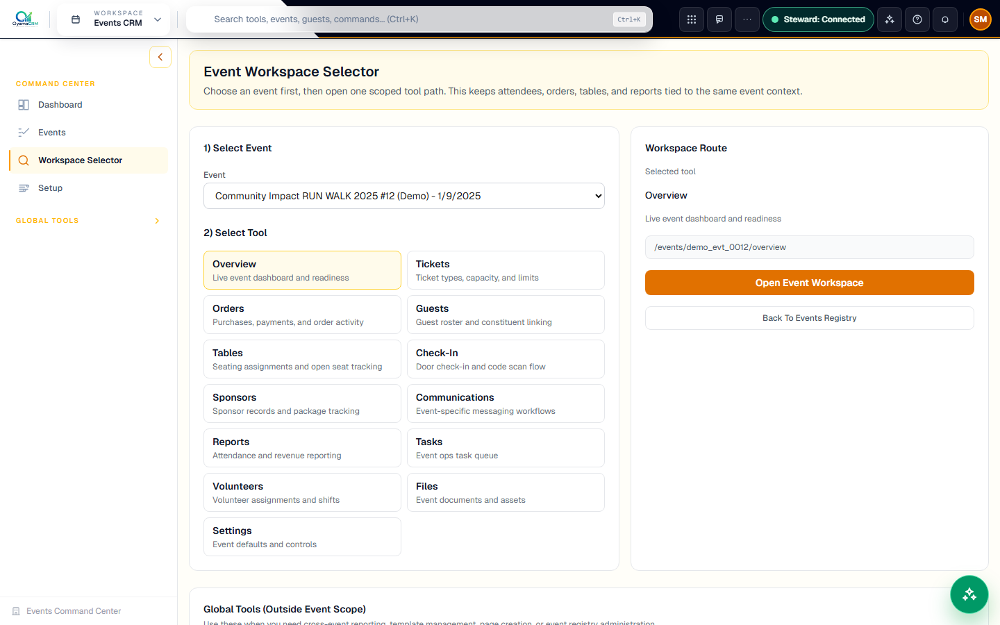
> Event-first workspace selector. Choose an event, then open scoped tools: Tickets, Orders, Guests, Tables, Check-In, Sponsors, Reports, and Tasks.

---

## Feature Inventory

See [FEATURES.md](FEATURES.md) for the complete platform feature inventory with status labels for all modules.

---

## DonorCRM Features

### Fundraising Core
- **Dashboard** — Live revenue progress, campaign health, donor retention, giving trends, top donors, recent gifts, tasks, and meeting widgets. Fully customizable layout.
- **Constituents** — Full constituent profiles with giving history, engagement timeline, task tracking, communication log, custom fields, and household relationships.
- **Donations** — Donation ledger with YTD/all-years scope toggle, Complete Loop one-click stewardship orchestration (email draft + follow-up task + steward path enrollment), and QuickBooks queue integration.
- **Campaigns** — Campaign goal tracking with attainment progress, active/inactive views, and multi-year scope support.
- **Grants** — Grant research workspace with Research Board, Library, Deadlines, Tasks, and Funder views. Deadline-driven urgent queue. Award money recorded separately in Donations.
- **Pledges** — Pledge commitment tracking with fulfillment percentage.

### AI-Powered Engagement Workspace
- **Steward AI** — Connected AI assistant with live runtime status indicator in the top bar. Supports donor chat, report generation, email drafting, call scripts, and multi-stage reasoning.
- **Steward Signals** — Explainable donor intelligence engine. Live counts for high-opportunity donors, at-risk cadences, monthly giving candidates, and pending thank-yous.
- **Steward Paths** — Visual outreach workflow automation. Build paths triggered by donation events, manual triggers, or schedules with per-step action definitions including branch conditions.
- **Tasks** — Work queue with My Work, Team Queue, Follow-Ups, and Completed tabs. Bulk assignment, assignment/overdue notifications, and lifecycle tracking.

### Communication Tools
- **Communications** — Campaign library, draft review queue, scheduled sends, and sent archive. Guided wizard (type → audience → preset → editor → review → send).
- **Email Builder** — Three-panel campaign studio (Block Library / Canvas / Inspector) with rich-text authoring, block types, merge tokens, and compliance footer enforcement.
- **Letters & Printables** — Print/mail/PDF workflow with generation wizard (template → recipients → preview → complete). Print queue, mail queue, and status lifecycle.
- **Contacts Manager** — Side-by-side audience list builder with saved segments, bulk tagging, duplicate detection, and HubSpot import presets.
- **LiveCom** — Live communications module (in development).

### Reports & Analytics
- **20 Report Templates** across 6 categories: Donor Intelligence, Giving, Retention, Campaigns & Funds, Stewardship, and Commitments.
- **ReportViewer** — Full workspace ribbon with 7 chart types, X-axis picker, multi-metric Y selector, 5 color themes, grid/legend/label/stack toggles, and CSV + PDF export.
- **Reports Manager** — Saved reports, scheduled reports, template library, and history tabs.

### Settings & Administration
- Integrations & Plugins (QuickBooks, email providers, Microsoft Graph OAuth)
- Security & Audit log
- Organization settings (name, address, timezone, fiscal year)
- User roles and permissions
- System status and version info (`/settings/system`)

---

## Help App

The built-in Help App at `/help` provides:
- **60 published articles** covering all major CRM workflows
- **Synonym-expanded search** — 60+ nonprofit-domain term expansions for natural-language queries
- **Contextual route suggestions** — 35+ route prefix mappings auto-surface relevant guides
- **Feature readiness labels** — Articles show Working / Partially Working / Demo Only status
- **Walkthrough steps** — Step-by-step with optional deep-link route navigation
- **Help Agent planner** — Plain-language → route/article action suggestions

---

## Compassion CRM Features

- **Client profiles** — Intake, contact info, service history, assessments, appointments, care plans, and communication log. Privacy-first with role-based access controls.
- **Cases** — Case management linked to client profiles.
- **Appointments** — Scheduling with public booking widget support, slot generation, and conflict validation.
- **Follow-Ups** — Structured follow-up workflow for case workers.
- **Assessments** — Structured intake assessments and needs evaluations.
- **Referrals** — External referral tracking with follow-up status.
- **Importer** — CSV import with validation, duplicate detection, and review-before-commit workflow.

---

## Events CRM Features

- **Event-first workspace model** — Choose an event, then open scoped tools.
- **Tickets** — Ticket types (individual, table-of-N, comp, sponsored), capacity and pricing.
- **Guests** — Guest roster with check-in codes, payment status, RSVP tracking, and constituent linking.
- **Tables** — Seating chart with table shapes, positions, host names, and sponsored flags.
- **Check-In** — QR scan, search by name, and browse by table check-in modes.
- **Sponsors** — Sponsor packages with included seats and auto-assignment.
- **Reports** — Cross-event attendance and revenue reporting.

---

## Tech Stack

| Layer | Technology |
|-------|-----------|
| **Frontend** | Next.js 16 (App Router), TypeScript, Tailwind CSS 4 |
| **Backend** | Node.js + Express, TypeScript |
| **Database** | MySQL 8 + Prisma ORM |
| **Charts** | Recharts 3 |
| **Auth** | JWT + bcrypt, MFA support |
| **AI** | Configurable provider (Ollama/OpenAI compatible), Steward AI runtime |
| **Desktop** | Electron (OyamaBridgeDesktopServer) |
| **Testing** | Vitest + Playwright |

---

## Quick Start

### Prerequisites
- Node.js 20+
- pnpm 9+
- MySQL 8

### Development

```bash
# Install dependencies
pnpm install

# Set up environment
cp .env.example .env.local
# Edit .env.local with your DB and API settings

# Run database migrations
pnpm db:migrate

# Seed demo data (choose small, medium, or large)
pnpm db:seed:medium

# Start both frontend and API server
pnpm dev:all
```

The app starts at `http://localhost:3000`. The API runs at `http://localhost:4000`.

Demo credentials (after seeding): `admin@hopefoundation.org` / `admin123!`

### Production Build

```bash
pnpm build          # Next.js production build
pnpm build:server   # Express API build
pnpm start          # Start Next.js
pnpm start:server   # Start API server
```

---

## Documentation

| Document | Purpose |
|----------|---------|
| [FEATURES.md](FEATURES.md) | **Complete feature inventory with status labels** |
| [docs/MASTER_PLAN.md](docs/MASTER_PLAN.md) | High-level plan and reality audit |
| [docs/HELP_APP.md](docs/HELP_APP.md) | Help App architecture, articles, and search design |
| [docs/status/features.md](docs/status/features.md) | Feature-by-feature implementation status |
| [docs/status/production-readiness-checklist.md](docs/status/production-readiness-checklist.md) | Production release gate |
| [docs/howto/HOW_TO_USE.md](docs/howto/HOW_TO_USE.md) | Office operating guide |
| [docs/howto/USER_GUIDE.md](docs/howto/USER_GUIDE.md) | Staff user guide |
| [docs/modules/donor-crm/README.md](docs/modules/donor-crm/README.md) | DonorCRM module guide |
| [docs/DONOR_CRM_AUDIT.md](docs/DONOR_CRM_AUDIT.md) | DonorCRM current-state audit |
| [docs/CLIENT_CRM_AUDIT.md](docs/CLIENT_CRM_AUDIT.md) | Compassion CRM audit |
| [docs/AI_TOOL_REGISTRY.md](docs/AI_TOOL_REGISTRY.md) | AI tooling registry |

---

## Testing

```bash
pnpm test:unit          # Unit tests (Vitest)
pnpm test:api           # API integration tests
pnpm test:smoke         # Smoke tests
pnpm test:smoke:routes  # Route smoke checks
pnpm test:e2e           # End-to-end tests (Playwright)
pnpm test:e2e:mobile    # Mobile viewport E2E
pnpm test:regression    # Regression suite
pnpm test:coverage      # Coverage report
pnpm test:ci            # Full CI suite
```

Testing documentation: [docs/testing/README.md](docs/testing/README.md)

---

## Project Structure

```
app/              — Next.js App Router pages and components
  components/     — Shared and feature-specific components
    layout/       — AppShell, TopBar, Sidebar, breadcrumb bar
    ui/           — Reusable primitives (buttons, cards, badges)
    dashboard/    — Dashboard widgets
    donor-reports/— Reports library, ReportViewer, Reports Manager
    steward/      — Steward Signals, Steward Paths, AI artifacts
    communications/— Campaign workspace, email builder
    letters/      — Letters & Printables workspace
    help/         — Help App components (search, articles, agent)
  compassion/     — Compassion CRM routes
  events/         — Events CRM routes
  grants/         — Grants workspace
  data-tools/     — Import/export, data quality tools
  help/           — Help App routes (/help, /help/[slug])
  help-content/   — Articles, search engine, route maps
server/           — Express API (TypeScript)
  src/
    routes/       — API route handlers
    services/     — Business logic services
prisma/           — Prisma schema and migrations
docs/             — Documentation
  status/         — Feature status, readiness checklists
  modules/        — Module-specific guides and QA reports
  howto/          — Operator and staff guides
tests/            — Vitest unit tests, Playwright E2E tests
README_SCREENSHOTS/       — Latest screenshots (captured 2026-05-18)
  v1.1.0/         — v1.1.0 versioned screenshot set (25 images)
FEATURES.md       — Complete feature inventory
```

---

## Architecture Highlights

- **Shared workspace patterns** — Workspaces aim for consistent navigation and action placement, but individual tools can choose the layout that fits the workflow.
- **Module isolation** — DonorCRM, Compassion CRM, and Events CRM data is isolated by default. Cross-module linking uses explicit shared-person references with permission checks.
- **Draft-first communication** — All outbound communications (email, letters, AI drafts) default to draft/review state. Nothing sends automatically.
- **Audit logging** — Every significant CRM action writes an audit event. Visible in the Security & Audit settings workspace.
- **AI transparency** — Steward AI uses explainable signals and deterministic fallback (rules-mode) when AI is unavailable. All write actions require human confirmation.
- **QuickBooks integration** — Manual sync only. Staff must explicitly queue donations and trigger sync. SYNCED items are immutable for audit compliance.
- **Built-in Help App** — 60 searchable help articles with synonym expansion, route-aware contextual suggestions, and walkthrough steps for all major workflows.

---

_Screenshots captured 2026-05-18 with medium demo seed. See [README_SCREENSHOTS/v1.1.0/](README_SCREENSHOTS/v1.1.0/) for the full 25-screenshot v1.1.0 set._


---

## What is OyamaCRM?

OyamaCRM is an integrated nonprofit management platform built for teams that manage donors, clients, and events in one place.

| Module | Focus |
|--------|-------|
| **DonorCRM** | Donors, donations, campaigns, stewardship, grants, communications |
| **Compassion CRM** | Client intake, cases, appointments, care plans, assessments |
| **Events CRM** | Event ticketing, guests, seating, check-in, sponsors |

---

## Screenshots

### DonorCRM Dashboard

> Real-time fundraising overview with Revenue Progress widget, Campaign Goal Health, Donor Retention, Engagement Pulse, and customizable widget layout.

### Steward Signals — AI-Powered Donor Intelligence

> Live donor intelligence: 243 high-opportunity donors, 796 at-risk, 138 monthly giving candidates. Daily Steward Thought generated by AI with Growth Ideas at 81–88% confidence.

### Reports — 20 Template Library

> 20 curated report templates across Donor Intelligence, Giving, Retention, Campaigns & Funds, Stewardship, and Commitments categories. One-click Run Report with year selector.

### Grants Research Workspace

> Grant opportunity tracking with Research Board, Grant Library, Deadlines, Grant Tasks, and Funders views. Deadline-driven urgent queue and at-risk pipeline overview.

### Steward Paths — Automated Outreach Workflows

> Visual workflow automation library with 31 saved paths. Each path shows trigger type (MANUAL, DONATION_RECEIVED), target, steps, enrollments, and last-run status.

### Communications Campaign Workspace

> Full campaign workspace with PROJECTS, AUDIENCE, DESIGN, REVIEW, and SEND ribbon groups. Guided wizard flow for new campaign creation. Donor Engagement System integration banner.

### Events CRM — Workspace Selector

> Event-first workspace selector. Choose an event, then open scoped tools: Tickets, Orders, Guests, Tables, Check-In, Sponsors, Reports, Tasks, Volunteers, Files, and Settings.

---

## DonorCRM Features

### Fundraising Core
- **Dashboard** — Live revenue progress, campaign health, donor retention, giving trends, top donors, recent gifts, tasks, and meeting widgets. Fully customizable layout with drag-and-drop reordering.
- **Constituents** — Full constituent profiles with giving history, engagement timeline, task tracking, communication log, custom fields, and household relationships.
- **Donations** — Donation ledger with YTD/all-years scope toggle, Complete Loop one-click stewardship orchestration (email draft + follow-up task + steward path enrollment), and QuickBooks queue integration.
- **Campaigns** — Campaign goal tracking with attainment progress, active/inactive views, and multi-year scope support.
- **Grants** — Grant research workspace with Research Board, Library, Deadlines, Tasks, and Funder views. Deadline-driven urgent queue. Award money recorded separately in Donations.
- **Payments** — Payment processor integration layer.

### AI-Powered Engagement Workspace
- **Steward AI** — Connected AI assistant with live runtime status indicator in the top bar. Supports donor chat, report generation, email drafting, call scripts, and multi-stage reasoning.
- **Steward Signals** — Explainable donor intelligence engine. Live counts for high-opportunity donors, at-risk cadences, monthly giving candidates, and pending thank-yous. Daily Steward Thought and Growth Ideas with confidence scores.
- **Steward Paths** — Visual outreach workflow automation. Build paths triggered by donation events, manual triggers, or schedules with per-step action definitions.
- **Tasks** — Work queue with My Work, Team Queue, Follow-Ups, and Completed tabs. Bulk assignment, assignment/overdue notifications, and lifecycle tracking.
- **Meetings** — Meeting scheduling and notes linked to constituents.

### Communication Tools
- **Communications** — Campaign library, draft review queue, scheduled sends, and sent archive. Guided wizard (type → audience → preset → editor → review → send). AI Draft and Import Draft support.
- **Email Builder** — Three-panel campaign studio (Block Library / Canvas / Inspector) with rich-text authoring, block types, merge tokens, and compliance footer enforcement.
- **Letters & Printables** — Print/mail/PDF workflow with generation wizard (template → recipients → preview → complete). Print queue, mail queue, and status lifecycle (Draft → Approved → Queued For Print → Printed → Mailed).
- **LiveCom** — Live communications module (in development).

### Reports & Analytics
- **20 Report Templates** across 6 categories:
  - *Donor Intelligence* — Donor Summary, Major Donors, Lybunt Analysis, New Donor Report
  - *Giving* — Donation History, YTD Giving, Monthly Giving, Recurring Giving Analysis
  - *Retention* — Donor Retention, Lapsed Donors, Upgrade/Downgrade, First-Time Donor Conversion
  - *Campaigns & Funds* — Campaign Performance, Designation Summary, Gift Officer Report
  - *Stewardship* — Stewardship Activity, Thank-You Tracking, Follow-Up Pipeline
  - *Commitments* — Pledge Status, Pledge Fulfillment
- **ReportViewer** — Full workspace ribbon with 7 chart types (Bar, Line, Area, Pie, Donut, Composed, Scatter), X-axis picker, multi-metric Y selector, 5 color themes, grid/legend/label/stack toggles, compact/normal/tall height options, and CSV + PDF export.
- **Reports Manager** — Saved reports, scheduled reports, template library, and history tabs.

### Settings & Administration
- Integrations & Plugins (QuickBooks, email providers)
- Security & Audit log
- Custom fields
- Organization settings
- User roles and permissions

---

## Compassion CRM Features

- **Client profiles** — Intake, contact info, service history, assessments, appointments, care plans, and communication log. Privacy-first with role-based access controls.
- **Cases** — Case management linked to client profiles.
- **Appointments** — Scheduling with public booking widget support, slot generation, and conflict validation.
- **Follow-Ups** — Structured follow-up workflow for case workers.
- **Importer** — CSV import with validation, duplicate detection, and review-before-commit workflow.
- **Data Tools** — Client-scoped data quality and import management.

---

## Events CRM Features

- **Event-first workspace model** — Choose an event, then open scoped tools.
- **Tickets** — Ticket types (individual, table-of-N, comp, sponsored), capacity and pricing.
- **Guests** — Guest roster with check-in codes, payment status, RSVP tracking, and constituent linking.
- **Tables** — Seating chart with table shapes, positions, host names, and sponsored flags.
- **Check-In** — QR scan, search by name, and browse by table check-in modes.
- **Sponsors** — Sponsor packages with included seats and auto-assignment.
- **Orders** — Purchase and payment activity tracking.
- **Communications** — Event-specific messaging workflows.
- **Reports** — Attendance and revenue reporting.
- **Global Tools** — Cross-event reporting, page builder, template management, and events registry.

---

## Tech Stack

| Layer | Technology |
|-------|-----------|
| **Frontend** | Next.js 16 (App Router), TypeScript, Tailwind CSS |
| **Backend** | Node.js + Express, TypeScript |
| **Database** | MySQL 8 + Prisma ORM |
| **Charts** | Recharts 3 |
| **Auth** | JWT + bcrypt, MFA support |
| **AI** | Configurable provider (Ollama/OpenAI compatible), Steward AI runtime |
| **Desktop** | Electron (OyamaBridgeDesktopServer) |
| **Testing** | Vitest + Playwright |

---

## Quick Start

### Prerequisites
- Node.js 20+
- pnpm 9+
- MySQL 8

### Development

```bash
# Install dependencies
pnpm install

# Set up environment
cp .env.example .env.local
# Edit .env.local with your DB and API settings

# Run database migrations
pnpm db:migrate

# Seed demo data
pnpm db:seed

# Start both frontend and API server
pnpm dev:all
```

The app starts at `http://localhost:3000`. The API runs at `http://localhost:4000`.

Demo credentials (after seeding): `admin@hopefoundation.org` / `admin123!`

### Production Build

```bash
pnpm build          # Next.js production build
pnpm build:server   # Express API build
pnpm start          # Start Next.js
pnpm start:server   # Start API server
```

---

## Documentation

| Document | Purpose |
|----------|---------|
| [docs/MASTER_PLAN.md](docs/MASTER_PLAN.md) | High-level plan and reality audit |
| [docs/status/features.md](docs/status/features.md) | Feature-by-feature implementation status |
| [docs/status/production-readiness-checklist.md](docs/status/production-readiness-checklist.md) | Production release gate |
| [docs/howto/HOW_TO_USE.md](docs/howto/HOW_TO_USE.md) | Office operating guide |
| [docs/howto/USER_GUIDE.md](docs/howto/USER_GUIDE.md) | Staff user guide |
| [docs/modules/donor-crm/README.md](docs/modules/donor-crm/README.md) | DonorCRM module guide |
| [docs/DONOR_CRM_AUDIT.md](docs/DONOR_CRM_AUDIT.md) | DonorCRM current-state audit |
| [docs/CLIENT_CRM_AUDIT.md](docs/CLIENT_CRM_AUDIT.md) | Compassion CRM audit |
| [docs/AI_TOOL_REGISTRY.md](docs/AI_TOOL_REGISTRY.md) | AI tooling registry |

---

## Testing

```bash
pnpm test:unit          # Unit tests (Vitest)
pnpm test:api           # API integration tests
pnpm test:smoke         # Smoke tests
pnpm test:smoke:routes  # Route smoke checks
pnpm test:e2e           # End-to-end tests (Playwright)
pnpm test:e2e:mobile    # Mobile viewport E2E
pnpm test:regression    # Regression suite
pnpm test:coverage      # Coverage report
pnpm test:ci            # Full CI suite
```

Testing documentation: [docs/testing/README.md](docs/testing/README.md)

---

## Project Structure

```
app/              — Next.js App Router pages and components
  components/     — Shared and feature-specific components
    layout/       — AppShell, TopBar, Sidebar, breadcrumb bar
    ui/           — Reusable primitives (buttons, cards, badges)
    dashboard/    — Dashboard widgets
    donor-reports/— Reports library, ReportViewer, Reports Manager
    steward/      — Steward Signals, Steward Paths, AI artifacts
    communications/— Campaign workspace, email builder
    letters/      — Letters & Printables workspace
  compassion/     — Compassion CRM routes
  events/         — Events CRM routes
  grants/         — Grants workspace
  data-tools/     — Import/export, data quality tools
server/           — Express API (TypeScript)
  src/
    routes/       — API route handlers
    services/     — Business logic services
prisma/           — Prisma schema and migrations
docs/             — Documentation
  status/         — Feature status, readiness checklists
  modules/        — Module-specific guides and QA reports
  howto/          — Operator and staff guides
tests/            — Vitest unit tests, Playwright E2E tests
README_SCREENSHOTS/ — App screenshots (captured 2026-05)
```

---

## Architecture Highlights

- **Shared workspace patterns** — Workspaces aim for consistent navigation and action placement, but individual tools can choose the layout that fits the workflow.
- **Module isolation** — DonorCRM, Compassion CRM, and Events CRM data is isolated by default. Cross-module linking uses explicit shared-person references with permission checks.
- **Draft-first communication** — All outbound communications (email, letters, AI drafts) default to draft/review state. Nothing sends automatically.
- **Audit logging** — Every significant CRM action writes an audit event. Visible in the Security & Audit settings workspace.
- **AI transparency** — Steward AI uses explainable signals and deterministic fallback (rules-mode) when AI is unavailable. All write actions require human confirmation.
- **QuickBooks integration** — Manual sync only. Staff must explicitly queue donations and trigger sync. SYNCED items are immutable for audit compliance.

---

_Screenshots captured May 2026. See [README_SCREENSHOTS/](README_SCREENSHOTS/) for the full set._
