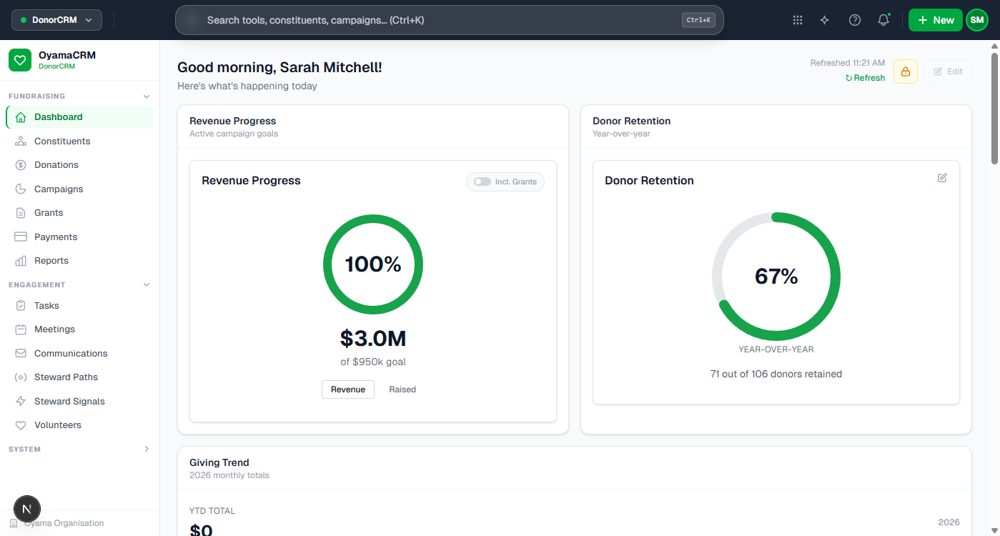
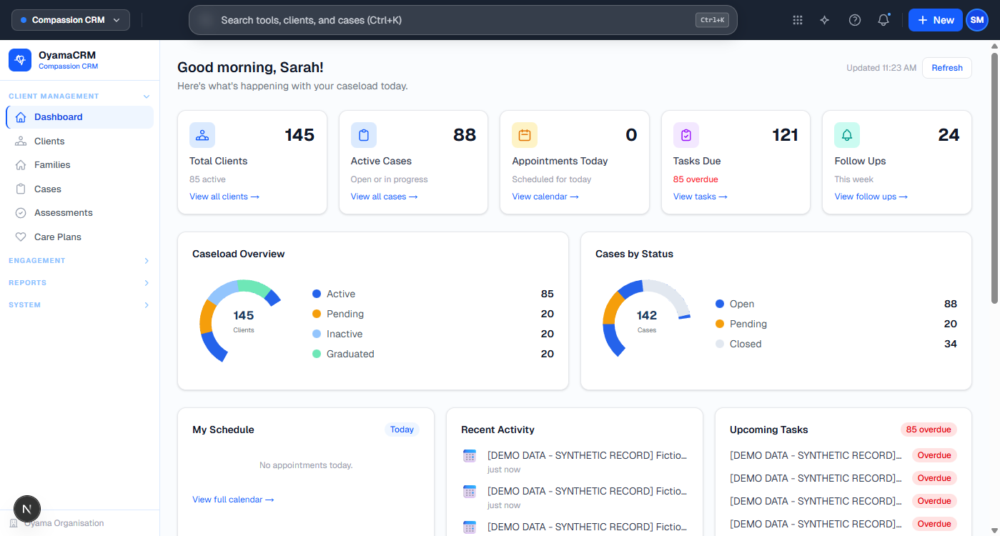
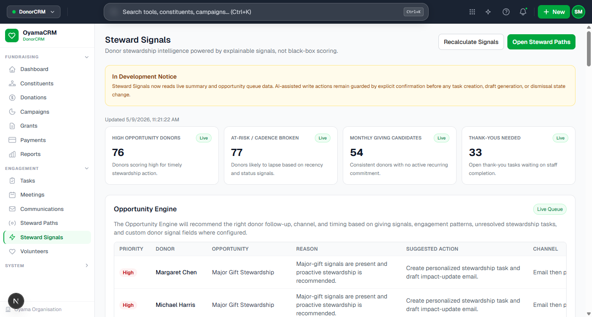
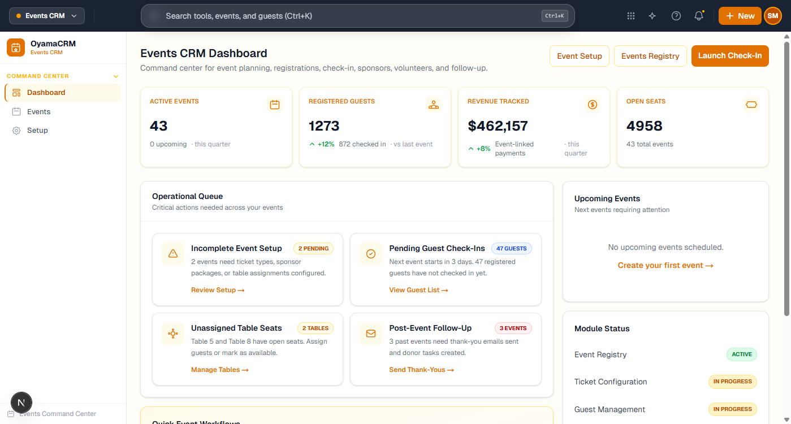

<div align="center">


# OyamaCRM

### One platform. Two modules. Built for the mission.

**DonorCRM** · Donor stewardship, fundraising campaigns, and retention analytics  
**Compassion CRM** · Client cases, care plans, appointments, and caseload management

<br>

[-16a34a?style=flat-square)](##-license)
[](https://nextjs.org)
[](https://prisma.io)
[](https://typescriptlang.org)

</div>

---

## 🟢 DonorCRM — Fundraising & Donor Stewardship

> A calm, professional workspace for managing constituents, donations, campaigns, tasks, and retention — built specifically for nonprofits, not adapted from a generic sales CRM.



<details>
<summary><strong>DonorCRM Features</strong></summary>

| Area | What's Included |
|------|----------------|
| **Dashboard** | Revenue progress ring, donor retention rate, tasks widget, totals-by-level bar chart, real-time refresh |
| **Constituents** | Full profiles, giving history, engagement timeline, household relationships, donor status tracking |
| **Donations** | One-time & recurring gifts, pledge management, batch entry, receipt generation, payment methods |
| **Campaigns** | Goal tracking, multi-channel campaigns, progress charts, peer-to-peer fundraising, matching gifts |
| **Communications** | Email builder, templates, segmented audiences, automation rules, open/click tracking |
| **Tasks** | Assignment, due dates, priority levels, stewardship workflow templates, overdue alerts |
| **Reports** | YTD revenue, donor retention, giving trends, campaign performance, exportable |
| **Data Tools** | CSV import wizard with field mapping, duplicate detection, merge workflow, dry-run mode |
| **Settings** | Organization profile, users & roles, audit logs, system status, feature readiness |

</details>

---

## 🔵 Compassion CRM — Client Care & Case Management

> A dedicated blue-themed workspace for social service teams — built alongside DonorCRM in the same platform but with completely separate data boundaries and permissions.



<details>
<summary><strong>Compassion CRM Features</strong></summary>

| Area | What's Included |
|------|----------------|
| **Dashboard** | Blue-themed dashboard shell with static placeholder metrics/charts (not fully API-backed yet) |
| **Clients** | Route scaffold exists; CRUD workflow not yet implemented |
| **Cases** | Route scaffold exists; case model/API not yet implemented |
| **Assessments** | Planned; UI scaffold only |
| **Care Plans** | Planned; UI scaffold only |
| **Appointments** | Planned; UI scaffold only |
| **Activities** | Planned; UI scaffold only |
| **Follow Ups** | Planned; UI scaffold only |
| **Reports** | Planned; UI scaffold only |

</details>

---

## 📸 App Screenshot Gallery

Screenshots are captured from the local app and stored in the repository root folder `README_SCREENSHOTS/`.

For privacy, README visuals are limited to high-level pages that avoid exposing potentially real email addresses.

### DonorCRM Dashboard


### Steward Signals Workspace


### Compassion CRM Dashboard


### Events Command Center


---

## 🏗️ Architecture

```
OyamaCRM
├── app/                        # Next.js 16 frontend
│   ├── components/
│   │   ├── layout/             # AppShell (green), CompassionShell (blue), TopBar, Sidebars
│   │   ├── ui/                 # Shared primitives (buttons, cards, badges, inputs)
│   │   └── dashboard/          # Widget components (RevenueProgress, DonorRetention, etc.)
│   ├── compassion/             # Compassion CRM module — /compassion/* routes
│   ├── settings/               # Settings workspace — /settings/* routes
│   ├── data-tools/import/      # CSV import wizard (fieldMap.ts, ImportWizard.tsx)
│   └── setup/                  # First-run onboarding flow
├── server/src/                 # Express 5 API
│   └── routes/                 # REST endpoints (auth, constituents, donations, etc.)
└── prisma/                     # MySQL schema + migrations + seed
```

**Module boundary rule:** Donor records and client records are distinct. Sensitive client data never surfaces in DonorCRM. Donor giving history never surfaces in Compassion CRM without explicit permission.

---

## ⚡ Quick Start

```bash
# 1. Clone and install
git clone https://github.com/jamesk9526/OyamaCRM.git
cd OyamaCRM
npm install --force          # or: pnpm install

# 2. Configure environment
cp .env.example .env
# Edit .env — set DATABASE_URL, JWT_SECRET, API_PORT

# 3. Initialize database
npx prisma migrate dev
pnpm db:seed:small

# 4. Start development (web + API together)
npm run dev:all
```

Open **http://localhost:3000** — the setup wizard will guide you through first-run configuration.

> **Dev credentials (after seed):**  
> `admin@hopefoundation.org` / `admin123!`  
> `james@hopefoundation.org` / `staff123!`

### Demo Seed Profiles

```bash
pnpm db:seed:small
pnpm db:seed:medium
pnpm db:seed:large
pnpm db:verify:demo
pnpm db:reset:demo
```

Full seed-system details: `docs/status/demo-seed-system.md`.

### Health & Status Endpoints

| Endpoint | Purpose |
|----------|---------|
| `GET /api/health` | API health + version info |
| `/settings/system` | Runtime version page |
| `/settings/system-status` | Feature readiness center |

---

## 💡 Design System

| Token | Value | Used For |
|-------|-------|---------|
| **Green-600** | `#16a34a` | DonorCRM accents, primary actions, active states |
| **Blue-600** | `#2563eb` | Compassion CRM accents, case management UI |
| **White** | `#ffffff` | Page backgrounds, card surfaces |
| **Gray-50** | `#f9fafb` | Content area backgrounds |
| **Gray-200** | `#e5e7eb` | Borders, dividers |

Both modules share the same layout shell structure, typography, card style, spacing, and component primitives — only the accent color differs.

---

## 📋 License

### Free Forever — No Strings Attached

OyamaCRM is **free forever** under the following conditions:

#### ✅ Always Free
| Use Case | Free? |
|----------|-------|
| **Self-hosted with your own GPU** (AI/LLM features powered by local models) | **Free forever** |
| **Simple workflow users** — organizations using core CRM features without AI or premium integrations | **Free forever** |
| Development, testing, evaluation | **Free forever** |
| Non-commercial nonprofit use (self-hosted) | **Free forever** |

#### 💼 Commercial / Hosted Plans *(coming soon)*
Cloud-hosted deployment, managed infrastructure, premium SLAs, and commercial support tiers will be available separately. Self-hosted users are never affected.

> **The promise:** If you run OyamaCRM on your own server — whether you're a small nonprofit tracking 50 donors or a social services team managing 500 cases — you will never pay a license fee. Ever.

---

## 🗺️ Roadmap

- [x] App shell, auth, setup/onboarding flow
- [x] Constituents, donations, campaigns, tasks
- [x] Communications & automations (foundation)
- [x] Settings workspace with system status
- [~] Compassion CRM module shell (operational workflows still pending)
- [x] CSV import wizard with field mapping & duplicate detection
- [ ] Full users + roles/RBAC enforcement
- [ ] Email provider integration (SendGrid / Mailgun)
- [ ] AI-assisted donor insights (self-hosted LLM support)
- [~] Events CRM core operations (ticketing/sponsors/public registration still pending)
- [ ] Mobile-responsive layouts
- [ ] Public giving pages / donation forms
- [ ] Advanced reporting & data exports

---

<div align="center">

Built for nonprofits, by people who care about the mission. 💚

</div>
